# Zenvault — Architecture (HLD · LLD · ADRs)

> Companion to `tech_stack_corrected.md` and `feature_spec_corrected.md`.
> All diagrams are GitHub-flavored **Mermaid** — render natively in GitHub,
> VS Code, and most Markdown viewers.

---

## 1. Executive Summary

Zenvault is a local-first PKM and active-learning desktop app built on the
**Tauri 2 + Rust + React** stack. The physical file system is the source of
truth; everything else (SQLite index, in-memory caches, UI state, vector store)
is **derived, disposable, and rebuildable**. The Rust core owns all I/O,
parsing, AI routing, sync, and updates; the React layer is a thin renderer
talking over a typed Tauri IPC bridge.

---

## 2. High-Level Design (HLD)

### 2.1 System Context

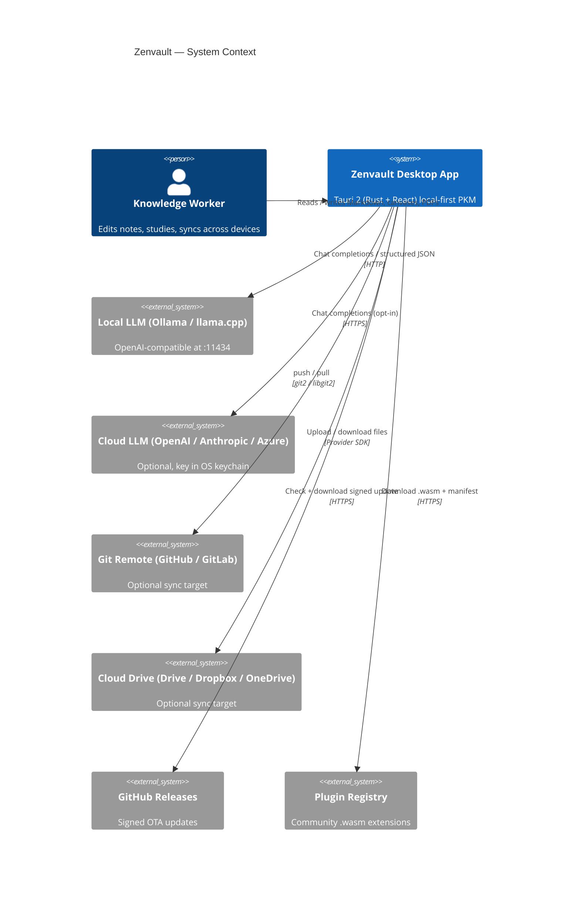

### 2.2 Container View

```mermaid
flowchart LR
    subgraph OS["Operating System"]
        FS[("Vault Folder<br/>*.md · *.canvas · assets/<br/>.zenvault/ · .trash/ · .archive/")]
        Keychain[("OS Keychain<br/>SSH / PAT / API keys")]
        Kernel{{"Kernel FS Events<br/>inotify · FSEvents · ReadDirectoryChangesW"}}
    end

    subgraph App["Zenvault Process"]
        direction LR

        subgraph Rust["Rust Core (native thread pool)"]
            Watcher[notify + debouncer]
            Parser[pulldown-cmark + frontmatter]
            DB[("rusqlite + FTS5<br/>r2d2 pool · WAL")]
            LLM[LLM Router<br/>async-openai]
            PDF[pdfium-render]
            Git[git2]
            Plugins[Extism v1<br/>WASM sandbox]
            Updater[tauri-plugin-updater]
            Commands[Typed Tauri Commands<br/>tauri-specta]
        end

        subgraph Web["Webview (React 18)"]
            UI[Layout / Tabs / Sidebar]
            Editor[CodeMirror 6 unmanaged]
            Graph[Pixi.js v8 + Web Worker<br/>d3-force]
            Canvas[@xyflow/react v12]
            Explorer[Virtualized File Tree<br/>react-virtual + dnd-kit]
            Store[Zustand · workspace state]
        end

        IPC{{Typed IPC · JSON · Async}}
    end

    FS <-->|Atomic writes / reads| Rust
    Kernel --> Watcher
    Watcher --> Parser --> DB
    PDF --> LLM --> DB
    Git <--> FS
    Keychain <--> Git
    Keychain <--> LLM

    Commands <--> IPC <--> Store
    Store --> UI & Editor & Graph & Canvas & Explorer

    Editor -->|save| Commands
    Explorer -->|move/rename| Commands
    Graph -->|get_graph_slice| Commands
    Canvas -->|read/write .canvas| Commands

    Plugins -.->|host fns| Commands
    Updater -.->|check+verify| Rust
```

### 2.3 Crate / Package Module Map

```mermaid
graph TD
    subgraph "zenvault-app (Tauri shell)"
        App[main.rs · setup · commands]
    end

    subgraph "Rust crates"
        Domain[zenvault-domain<br/>Pure types]
        DB[zenvault-db<br/>pool · migrations · repos]
        FS[zenvault-fs<br/>watcher · atomic writes · trash/archive]
        Parser[zenvault-parser<br/>md · blocks · anchors · frontmatter]
        PDF[zenvault-pdf<br/>pdfium-render]
        LLM[zenvault-llm<br/>provider router · JSON schema]
        FSRS[zenvault-fsrs<br/>SR scheduler]
        Git[zenvault-git<br/>git2 · keychain]
        Sync[zenvault-sync<br/>cloud adapters · conflict resolver]
        Plug[zenvault-plugins<br/>extism host]
        Search[zenvault-search<br/>fts5 · optional sqlite-vec]
    end

    subgraph "Frontend packages"
        UI[ui/<br/>React + Tailwind + Radix]
        EditorPkg[editor/<br/>CodeMirror 6 setup]
        GraphPkg[graph/<br/>Pixi v8 + worker]
        CanvasPkg[canvas/<br/>@xyflow/react]
        ExplorerPkg[explorer/<br/>react-virtual + dnd-kit]
        StorePkg[store/<br/>Zustand · workspace]
        Bindings[bindings.ts<br/>generated by tauri-specta]
    end

    App --> DB & FS & Parser & PDF & LLM & FSRS & Git & Sync & Plug & Search
    DB --> Domain
    Parser --> Domain
    LLM --> Domain
    Search --> DB

    UI --> EditorPkg & GraphPkg & CanvasPkg & ExplorerPkg & StorePkg
    StorePkg --> Bindings
    EditorPkg --> Bindings
    GraphPkg --> Bindings
    CanvasPkg --> Bindings
    ExplorerPkg --> Bindings
    Bindings -.->|invoke / listen| App
```

### 2.4 RAG / Tutor Ingestion Pipeline (Dataflow)

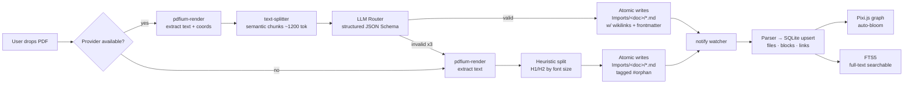

---

## 3. Low-Level Design (LLD)

### 3.1 Database Schema (Entity-Relationship)

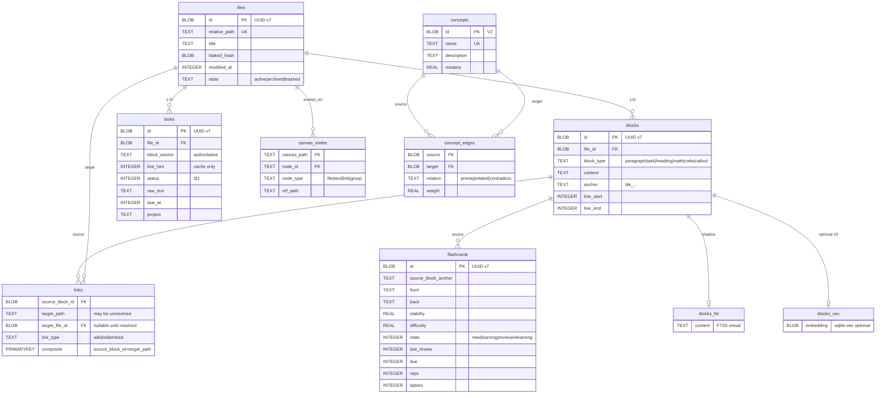

### 3.2 Vault Boot Sequence

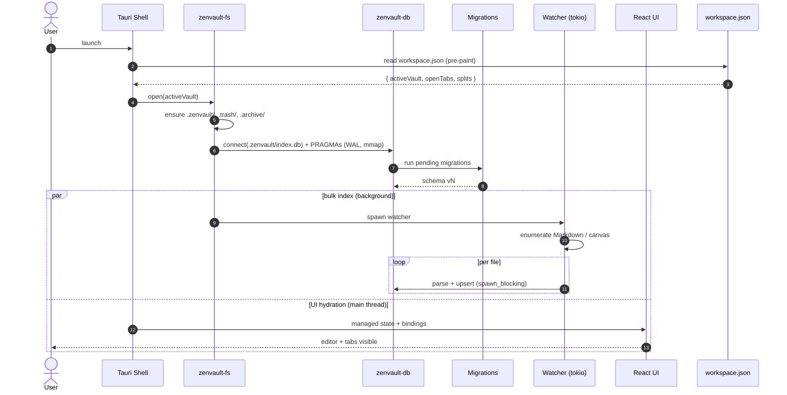

### 3.3 Save → Reindex Loop (Two-Way Task Binding)

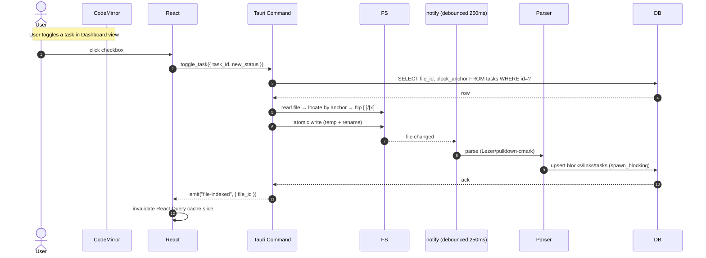

### 3.4 File Move with Wikilink Auto-Heal

```mermaid
sequenceDiagram
    autonumber
    actor U as User
    participant Exp as Explorer (dnd-kit)
    participant Cmd as move_file
    participant FS
    participant W
    participant Heal as Wikilink Healer
    participant DB

    U->>Exp: drag Physics.md → Science/
    Exp->>Cmd: move_file({ src, dst })
    Cmd->>DB: BEGIN; SELECT links WHERE target_path=src
    Cmd->>FS: fs::rename(src, dst) (atomic on same FS)
    FS-->>W: rename event
    W->>Cmd: forward
    Cmd->>Heal: rewrite [[Physics]] → [[Science/Physics]] in referrers
    loop per referrer
        Heal->>FS: atomic write of patched .md
    end
    Cmd->>DB: UPDATE files SET relative_path=dst WHERE id=?
    Cmd->>DB: UPDATE links SET target_path=dst WHERE target_path=src
    Cmd->>DB: COMMIT
    Cmd-->>Exp: { moved, rewritten_count }
```

### 3.5 PDF → Flashcards (Tutor Mode, BYOM)

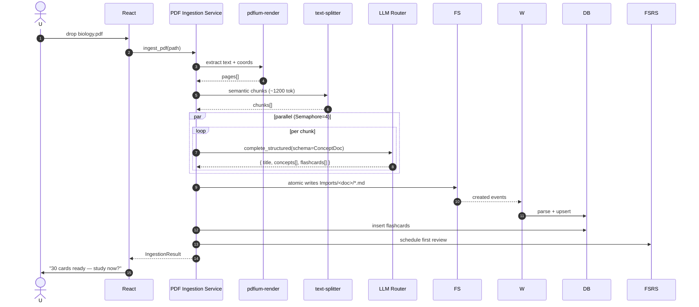

### 3.6 Hybrid Search Pipeline (V2 Optional Re-rank)

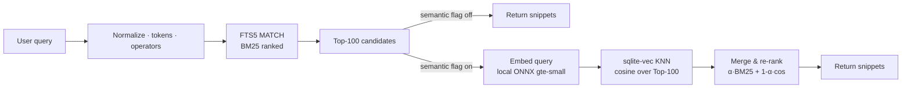

### 3.7 Plugin Lifecycle (Capability-Gated)

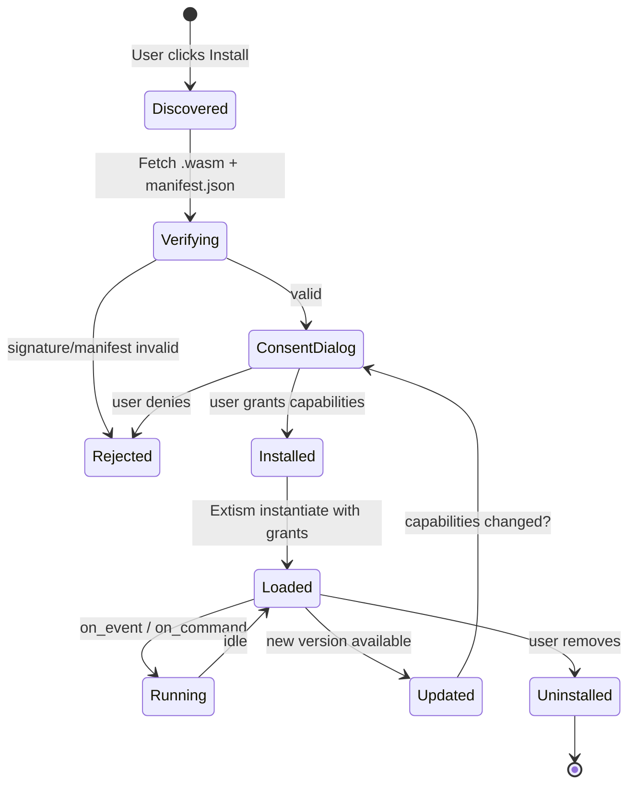

### 3.8 Archive / Trash State Machine

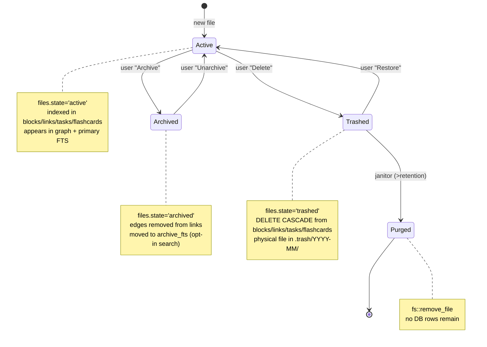

### 3.9 Sync — Conflict Resolution

```mermaid
flowchart TD
    A[Local change] --> B{Remote also changed?}
    B -- no --> C[Push / upload]
    B -- yes --> D{Both edited same lines?}
    D -- no --> E[3-way merge via diff3<br/>commit clean result]
    D -- yes --> F[Write Note (conflict YYYY-MM-DDTHH-MM-SS).md<br/>next to original]
    F --> G[Show 'Resolve conflicts' panel<br/>side-by-side diff]
    G --> H[User picks side or merges manually]
    H --> I[Delete conflict file · commit / upload]
```

### 3.10 OTA Update Flow

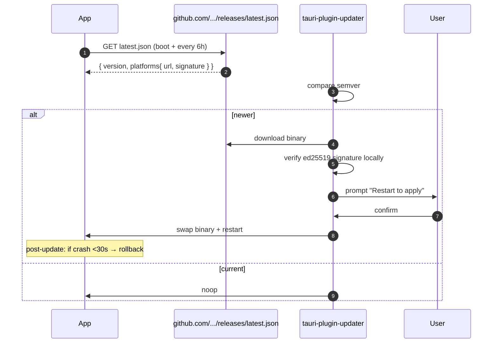

---

## 4. Architecture Decision Records (ADRs)

> Compact format: **Decision · Alternatives rejected · Why · Trade-off**.

| # | Decision | Rejected | Why | Trade-off |
|---|---|---|---|---|
| 1 | **Tauri 2 + Rust** | Electron + Node | Bundle <50 MB vs >150 MB; native WebView; Rust handles heavy I/O with predictable memory | Harder cross-compile; PDFium adds 15–30 MB per platform |
| 2 | **File system = source of truth** | Custom binary DB-of-record | Portability, Git compatibility, user ownership, recoverability | Need a robust derived-index strategy |
| 3 | **SQLite + FTS5 (adjacency list) for the graph** | Embedded graph DB (SurrealDB, IndraDB, KuzuDB), Neo4j Embedded | <5 MB add vs 100 MB+; instant rebuild; battle-tested; one flat file; sub-ms BM25; recursive CTE handles 100k concepts | No first-class Cypher; manual graph queries |
| 4 | **r2d2 pool + `spawn_blocking`** | `Arc<Mutex<Connection>>` | Pool avoids serializing all DB I/O; never await while holding a lock | Slightly more setup than a global mutex |
| 5 | **UUID v7 + Markdown `^blk_...` anchors** | Incremental `^blk_N` IDs / line numbers | Merge-safe across Git; survives external edits; time-ordered for B-tree locality | Anchors clutter raw Markdown (cosmetically) |
| 6 | **Raw CodeMirror 6 (`@codemirror/*`)** | `@uiw/react-codemirror` wrapper | Avoids React reconciliation on every keystroke; direct access to StateField/Decoration APIs | More manual wiring per integration |
| 7 | **Pixi v8 + Web Worker (postMessage)** | SVG / DOM graphs, SharedArrayBuffer | 60 fps at 100k nodes via WebGL; SAB needs COOP/COEP that breaks other libs | Custom hit-test logic; SAB deferred to V2 |
| 8 | **@xyflow/react v12 for canvases** | Pixi for canvases | xyflow is feature-rich (edge labels, minimap, controls); right tool for medium graphs | Pixi reserved for the high-density knowledge graph |
| 9 | **JSON Canvas 1.0 spec** | Proprietary `.canvas` JSON / TLDraw / Excalidraw format | Obsidian-compatible; portable; Git-friendly | Less rich than Excalidraw vectors |
| 10 | **Extism v1 WASM plugins + manifest capabilities** | Node plugins / unsandboxed JS | Default-deny FS/net; per-capability consent UX; cross-language plugin authoring | Plugin authors must compile to WASM |
| 11 | **async-openai for LLM router** | `ollama-rs` + bespoke OpenAI client | Ollama exposes OpenAI-compatible `/v1`; one client for all providers; supports JSON-mode + streaming | Lose a handful of Ollama-specific endpoints (model pull etc.) — wrap manually if needed |
| 12 | **text-splitter for chunking** | Fixed token windows / hand-written splitter | Markdown-aware, tiktoken-accurate, semantic boundaries | Slightly slower than naive splits |
| 13 | **git2 (vendored libgit2)** | isomorphic-git, `git` CLI shellout | Memory-efficient diffs; no Node runtime; no external binary required | libgit2 ignores some `.git/hooks` customizations |
| 14 | **Conflict files for sync** | Auto-merge prose / CRDT | CRDTs over Markdown are user-hostile when conflicts surface; conflict files match user mental model (Obsidian convention) | User has to resolve manually |
| 15 | **3-pane DOM-virtualized explorer (`@tanstack/react-virtual` + `@dnd-kit`)** | Plain nested `<ul>` recursion | 100k-file vaults stay 60 fps; only ~30 rows live in DOM | Flat-tree representation must be re-flattened on expand/collapse |
| 16 | **Per-vault SQLite (not per-user)** | Single global DB | Each vault is fully portable; deleting vault folder removes all derived data | Cross-vault search needs an explicit federation step |
| 17 | **tracing + JSON logs** | `env_logger` / `log` | Structured spans for async commands; rotation via `tracing-appender`; sane for tokio | Slightly more setup than `println!` debugging |
| 18 | **Typed IPC via `tauri-specta`** | Hand-written TS DTOs | Single source of truth; refactor-safe across Rust ↔ TS | Build-time codegen step |

---

## 5. Cross-Cutting Concerns

### 5.1 Error Boundary

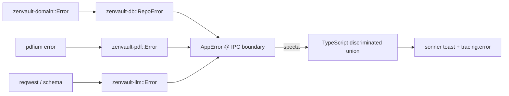

### 5.2 Threading Model

```mermaid
flowchart TB
    subgraph Tokio["tokio multi-threaded runtime"]
        TaskW[Watcher loop]
        TaskS[Sync loop (15m)]
        TaskJ[Janitor (24h)]
        TaskU[Updater (6h)]
        TaskO[FSRS optimizer (weekly, if ≥500 reviews)]
    end

    subgraph Blocking["spawn_blocking pool"]
        BB1[SQLite txns]
        BB2[PDF extract]
        BB3[Git operations]
        BB4[Hashing (BLAKE3)]
    end

    subgraph Webview["Webview JS thread"]
        UI
    end

    subgraph Worker["Web Workers"]
        Phys[d3-force physics]
        Embed[ONNX embeddings (V2)]
    end

    TaskW -->|messages| Blocking
    TaskS -->|messages| Blocking
    Webview -->|invoke| Tokio
    Tokio -->|emit| Webview
    Webview -->|postMessage| Worker
```

### 5.3 Performance Budget

| Action | Target | Mechanism |
|---|---|---|
| Cold launch (with restored workspace) | <2 s on M1 / similar | Pre-paint hydration from `workspace.json` |
| Open 1 MB note | <50 ms | CodeMirror 6 virtualized rendering |
| Search query | <30 ms p95 | FTS5 + 200 ms debounce + query coalescing |
| File save → index reflect | <500 ms p95 | Debounced watcher + spawn_blocking upsert |
| Graph render at 100k nodes | ≥45 fps | Pixi v8 ParticleContainer + worker physics |
| PDF (30 pages) → 30 cards | <60 s | Parallel Semaphore(4) LLM calls |
| Bulk index 100k files | ≤90 s | r2d2 pool · 8 workers · batched txns |

---

## 6. Folder Layout (Repo)

```
zenvault/
├── crates/
│   ├── zenvault-app/         # Tauri shell + commands + specta export
│   ├── zenvault-domain/
│   ├── zenvault-db/
│   │   └── migrations/0001_init.sql ...
│   ├── zenvault-fs/
│   ├── zenvault-parser/
│   ├── zenvault-pdf/
│   ├── zenvault-llm/
│   ├── zenvault-fsrs/
│   ├── zenvault-git/
│   ├── zenvault-sync/
│   ├── zenvault-plugins/
│   └── zenvault-search/
├── ui/
│   ├── src/
│   │   ├── editor/
│   │   ├── graph/
│   │   ├── canvas/
│   │   ├── explorer/
│   │   ├── store/
│   │   ├── components/        # Radix + Tailwind primitives
│   │   └── bindings.ts        # generated by tauri-specta
│   ├── workers/physics.worker.ts
│   ├── vite.config.ts
│   └── tailwind.config.ts
├── docs/
│   ├── architecture.md        # this file
│   ├── tech_stack_corrected.md
│   ├── feature_spec_corrected.md
│   └── adr/                   # extended ADRs as Markdown
├── .github/workflows/         # CI matrix + signed releases
├── Cargo.toml                 # workspace
└── README.md
```
