# DQoS - Full LLD: Tasks 1 through 4

> **What this is.** A single end-to-end Low-Level Design document covering all four implementation tasks for the DQoS Subscription Priority Metadata integration in AzCiM. Each task section shows the **before state**, **what was built**, **the key decisions**, and **flow diagrams**. Tasks follow the sprint order.

| | |
|---|---|
| **Author** | Vijay Gatla |
| **Date** | 12 June 2026 (updated - HLD traceability + review questions added) |
| **Parent HLD** | "Enabling DQoS in AzCiM" - Rahul |
| **Branch** | `dev/vijaygatla/azcim-dqos` |

---

```java
System.out.println("HELLO WORLD");
```
---
## Table of Contents

1. [Context and Problem Statement](#1-context-and-problem-statement)
2. [Previous Architecture - Baseline (pre-DQoS)](#2-previous-architecture--baseline-pre-dqos)
3. [Integrate RC Subscription Metadata API](#3-integrate-rc-subscription-metadata-api)
4. [Caching and Retrieval](#4-caching-and-retrieval)
5. [Send DQoS Priority Metadata to Allocator](#5-send-dqos-priority-metadata-to-allocator)
6. [Typed Telemetry](#6-typed-telemetry)
7. [End-to-End Architecture (post all tasks)](#7-end-to-end-architecture-post-all-tasks)
8. [Operational Gating and Settings](#8-operational-gating-and-settings)
9. [HLD Traceability - Every Comment and Open Item Resolved](#9-hld-traceability--every-comment-and-open-item-resolved)
10. [Open Questions and Suggestions for Review](#10-open-questions-and-suggestions-for-review)

---

## 1. Context and Problem Statement

**DQoS** (Differentiated Quality of Service) requires AzCiM to pass subscription-level priority signals to the Allocator so that placement decisions can be differentiated by subscription tier - e.g. sensitive workloads or high-priority subscriptions get preferential placement.

Before this work, AzCiM passed **zero subscription-level metadata** to the Allocator. Every allocation was treated identically regardless of what the subscription's priority tier was. The source of truth for this metadata is **Resource Central (RC)** - a co-located REST service on the same AzCP node.

The work breaks into four sequential tasks:

- **Integrate RC Subscription Metadata API** - wire up the HTTP client and facade - the raw API call
- **Caching and Retrieval** - add a subscription-scoped in-memory cache on top of the facade
- **Send DQoS Priority Metadata to Allocator** - map the metadata and stamp it onto Allocator requests at all 5 call sites
- **Typed Telemetry** - structured Geneva events for every cache and fetch outcome

---

## 2. Previous Architecture - Baseline (pre-DQoS)

### What existed before Task 1

AzCiM already had an `IResourceCentralClient` that called RC for **prediction metadata** (used for placement scoring). The subscription-metadata endpoint did not exist in this facade. The Allocator received `AllocationRequest` objects whose `PlatformAllocationConstraints.SubscriptionMetadataConstraints` was always empty (default).

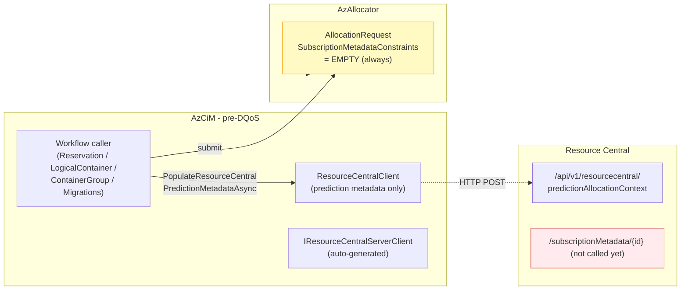

### Pre-DQoS `AllocationRequest` flow

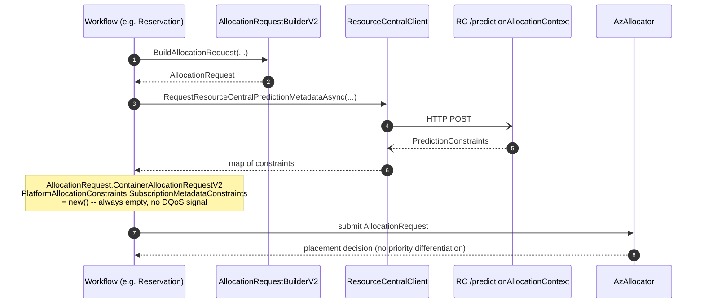

**What was missing:** no call to `/subscriptionMetadata`, no cache, no mapper, no telemetry. The Allocator treated every subscription identically.

---

## 3. Integrate RC Subscription Metadata API

After this task AzCiM can call RC for subscription metadata. No cache yet, and not wired into any workflow yet - this is purely the API layer.

### What changed

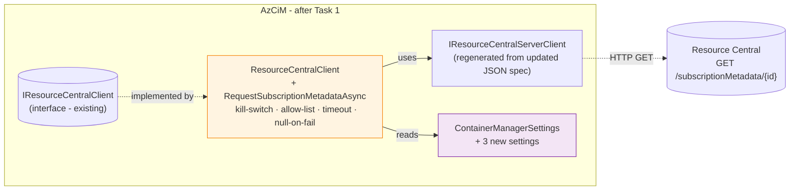

### Architecture evolution (before Task 1 vs after Task 1)

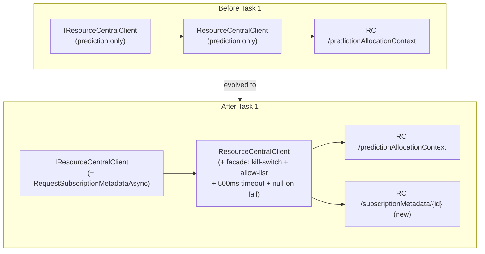

### Key design decisions

- **Hand-written facade over the generated client.** Business code (Reservation, ContainerGroup, etc.) should not know that RC speaks REST, has a timeout, or has a kill-switch. Keeping that in `ResourceCentralClient` means if the wire client shifts tomorrow, only the facade moves.

-  sdjkfhsdjk

-  sdfsd

-  sdfsdfsd

-  sdfsdfs

- **Kill-switch and allow-list as two separate settings, not one bool.** A single on/off flag forces a binary choice - all subscriptions or none. The allow-list lets us pilot specific subscriptions by GUID while the master switch is still off everywhere else. A ring inside a ring.

- **Return `null` on every failure path - never throw.** A method that throws different exception types for kill-switch off, timeout, and RC error leaks a four-way decision tree into every caller. `null` means "no useful answer right now" - the caller falls back to pre-DQoS defaults deterministically.

- **Auto-generated client from the JSON spec.** RC owns the wire contract. Generating from JSON makes the spec the single source of truth; drift is caught at codegen time, not in production.

- **BVT mock endpoint added first.** Adding the mock before the real facade means every layer above can be developed against a deterministic fixture and tested independently.

### New settings introduced

- `EnableResourceCentralSubscriptionMetadataClient` (default `false`) - master kill-switch for the subscription-metadata HTTP call
- `AllowlistedSubscriptionIdsForResourceCentralSubscriptionMetadataClient` (default empty) - per-subscription opt-in bypass while the master switch is off
- `ResourceCentralSubscriptionMetadataRequestTimeoutInMilliseconds` (default `500`) - per-call timeout; on expiry the facade returns `null` and the workflow continues

### Task 1 call flow

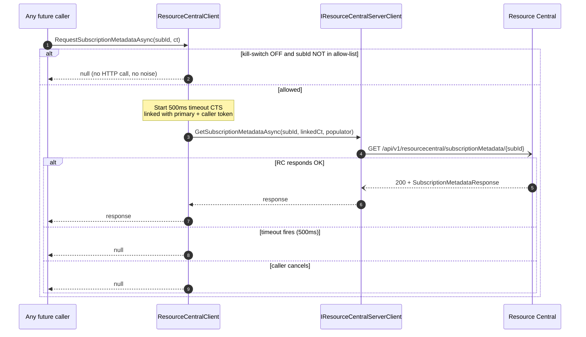

### What was touched

- `ResourceCentralServerClient.json` - new operation and schema definition
- `IResourceCentralClient.cs` - new method added to the interface
- `ResourceCentralClient.cs` - facade implementation with gate logic
- `ResourceCentralServerClientErrorTransformer.cs` - retry classifier updated
- Settings interface, concrete class, `Settings.xml`, `ApplicationManifest.xml` - 3 new flightable settings wired end to end
- `AzCiMBVTMock` (3 files) - mock endpoint for BVT
- `ResourceCentralClientTests.cs` - wire-format and facade unit tests

---

## 4. Caching and Retrieval

A subscription-scoped in-memory cache now sits in front of the facade. Workflows call `ISubscriptionMetadataProvider.GetOrFetchAsync` - they no longer talk to the RC client directly.

### What changed (Caching and Retrieval builds on top of the API integration)

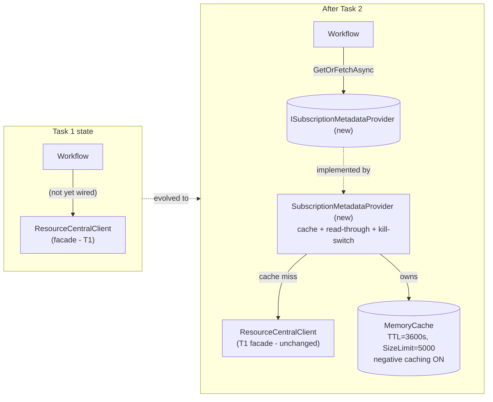

### Cache read-through flow (Task 2)

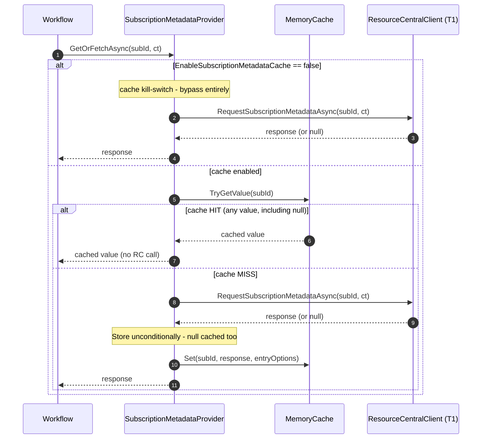

### Key design decisions

- **Separate `SubscriptionMetadataProvider`, not caching inside the facade.** The client has one reason to change (wire/transport); the provider has one reason to change (freshness/capacity policy). They evolve independently.

- **`ISubscriptionMetadataProvider` interface, not a concrete reference.** Callers depend on the abstraction. Tests inject a mock - no real `MemoryCache` required. If we swap in a distributed cache later, zero callers change.

- **`MemoryCache` from `Microsoft.Extensions.Caching.Memory`, not a custom dictionary.** The library is already in the dependency graph (AzTM uses it). Custom expiration code is a well-known source of subtle bugs - race between read and eviction, leaks if Dispose is forgotten.

- **Two config records - one for the cache container, one for each entry.** Cache-level config (capacity, scan frequency, compaction) and entry-level config (TTL, sliding, size weight) have different owners and change at different times. Combining them would create a single blob with two reasons to change.

- **Cache `null` responses (negative caching).** Without this, a subscription RC genuinely cannot answer would re-hit RC on every single reservation - a request storm against the exact API that is already misbehaving. With negative caching, every subscription costs at most one RC call per TTL window. The TTL is the staleness lever.

- **Two independent kill-switches - one from the previous task, one new here.** They answer different questions. The first asks "should we talk to RC at all?" The second asks "should we remember what RC said?" They need to be tunable independently.

- **`IDisposable` on the provider.** `MemoryCache` holds a background timer. Not disposing it on SF replica failover leaves the timer rooted on the old object graph - a real, if slow, leak.

### New settings introduced

- `EnableSubscriptionMetadataCache` (default `false`) - cache kill-switch; when off, every call goes directly to RC
- `SubscriptionMetadataCacheConfiguration` (default `SizeLimit=5000;CompactionPercentage=0.25;ExpirationScanFrequency=60`) - cache container policy: capacity and eviction behaviour
- `SubscriptionMetadataCacheEntryConfiguration` (default `ExpireAfter=3600`) - per-entry TTL in seconds

### What was touched

- `ISubscriptionMetadataProvider.cs` - new interface
- `SubscriptionMetadataProvider.cs` - concrete implementation with cache, read-through, kill-switch, and eviction logging
- `ContainerManagerService.cs` - composition-root wiring (single instance, single dispose path)
- Settings interface, concrete class, `Settings.xml`, `ApplicationManifest.xml` - 3 new flightable settings wired end to end
- `SubscriptionMetadataProviderTests.cs` - 13 unit tests covering hit, miss, negative caching, eviction, TTL expiry, dispose

---

## 5. Send DQoS Priority Metadata to Allocator

DQoS priority metadata now reaches the Allocator at all 5 V2 allocation call sites. Reservation was wired first as a pilot; the remaining four workflows followed once the pattern was validated.

### What changed (Allocator wiring builds on top of the cache layer)

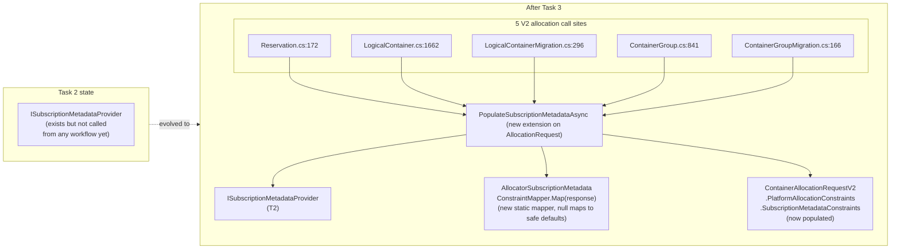

### T3 end-to-end flow (one allocation tick)

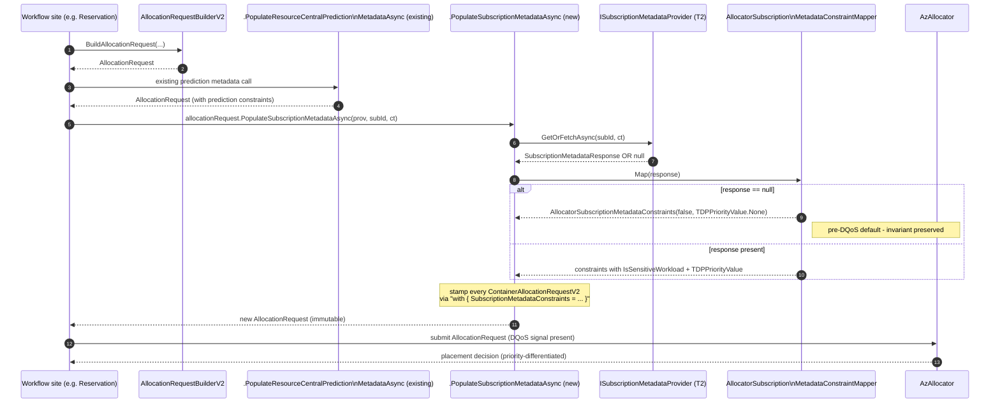

### Five call sites - one pattern

All five sites follow the identical shape - one `await` chained immediately after the existing `PopulateResourceCentralPredictionMetadataAsync` call. The only thing that differs per site is which field to read the subscription ID from, and which cancellation token to pass.

The two migration paths (`LogicalContainerMigration`, `ContainerGroupMigration`) pass `CancellationToken.None` - this is intentional and matches the token discipline of the surrounding prediction-metadata call in those same files.

### Key design decisions

- **Extension method on `AllocationRequest`, not a method on the provider.** The existing `PopulateResourceCentralPredictionMetadataAsync` is already an extension on `AllocationRequest`. Adding a second extension lets the two calls chain naturally. A method on the provider would invert the dependency direction - the provider would need to know about `AllocationRequest`, which it shouldn't.

- **Static mapper, not an injected interface.** The mapper has no state, no lifetime, no policy - it is a pure function. Wrapping it in an interface purely for DI ceremony is YAGNI. If a second consumer ever needs a different mapping shape, promoting it to an interface is a ~25-line refactor.

- **`null` response maps to safe defaults - mapper never throws.** The mapper is the firewall. Five call sites, zero try/catch blocks. A reservation that succeeded before DQoS still succeeds after, even if RC is completely unavailable.

- **Per-container stamping via `with { ... }` records, not in-place mutation.** Matches the shape of the existing prediction-metadata extension. Records prohibit mutation anyway; `with` is the only legal update path. The result is atomic - no observer ever sees a half-stamped request.

- **Case-insensitive parse for `TDPPriorityValue`.** RC has historically been inconsistent with casing on extended-property string values. A casing inconsistency silently flowing through as `None` is the right failure mode - better than a parse exception.

### What was touched

- `AllocationRequestExtensions.cs` - new `PopulateSubscriptionMetadataAsync` extension method
- `AllocatorSubscriptionMetadataConstraintMapper.cs` - new static mapper (null → safe defaults)
- `Reservation.cs`, `LogicalContainer.cs`, `LogicalContainerMigration.cs`, `ContainerGroup.cs`, `ContainerGroupMigration.cs` - provider field + ctor param + single call site each
- `ContainerManagerService.cs` - provider passed into all 5 workflow factories
- `AllocationRequestExtensionsTests.cs` - 2 extension tests (response present, response null)
- `AllocatorSubscriptionMetadataConstraintMapperTests.cs` - 9 mapper tests covering null input, IsSensitiveWorkload, every TDPPriorityValue, missing key, malformed value, case-insensitivity
- 29 existing unit test files - `Mock.Of<ISubscriptionMetadataProvider>()` injected into workflow ctor call sites

---

## 6. Typed Telemetry

Every cache and fetch outcome now emits a structured Geneva event queryable in Kusto. The verbose `ContextActivityLogger` log lines that existed before are gone.

### What changed (Telemetry builds on top of the Allocator wiring)

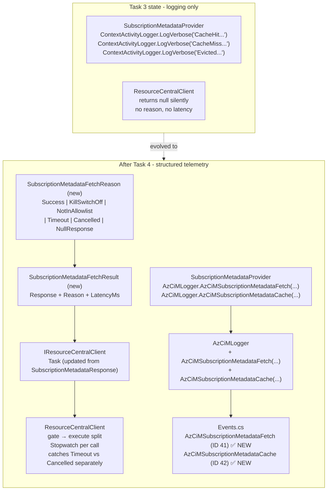

### Telemetry emission map

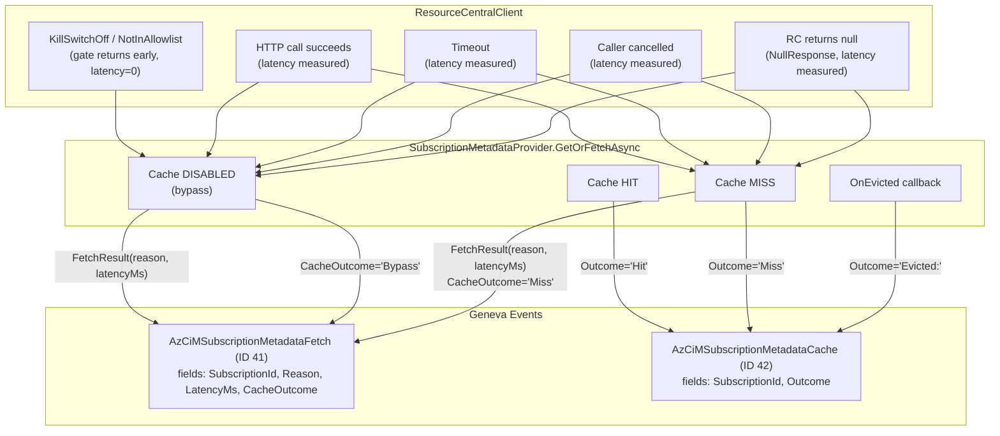

### Key design decisions

- **Return type promoted to `SubscriptionMetadataFetchResult` (wraps reason + latency).** Previously the client returned `SubscriptionMetadataResponse` or `null` - both silent about why. The result object gives the provider the full picture (reason and latency) without any side-channel logging or out-parameters.

- **`SubscriptionMetadataFetchReason` enum with 6 values** (`Success`, `KillSwitchOff`, `NotInAllowlist`, `Timeout`, `Cancelled`, `NullResponse`). A strongly-typed enum is queryable in Kusto by exact value. A free-form string would require substring matching and is easy to mistype.

- **`Stopwatch` measured inside the execute helper, not at the call site.** The client is the only place that knows exactly when the HTTP call started and ended. Measuring from outside the client would include marshalling overhead.

- **Two separate `EventInfo` structs (IDs 41 and 42).** The fetch event carries `LatencyMs` and `CacheOutcome`; the cache event carries only `Outcome`. Different fields - separate Kusto tables - cleaner queries. Putting them in one event would require nullable fields or a discriminated union.

- **Wrapper methods on `AzCiMLogger` fill all 6 prefix fields.** Every other AzCiM structured event follows this same pattern. Consistency means no caller can accidentally omit `PartitionId` or `IncarnationId`.

- **Gate→execute split in `ResourceCentralClient`.** The old method mixed "should I call RC?" with "how do I call RC?". Splitting into `GetSubscriptionMetadataGateReason` and `ExecuteSubscriptionMetadataRequestAsync` gives each helper one reason to change and makes the gate logic unit-testable in isolation.

### What was touched

- `SubscriptionMetadataFetchReason.cs` - new 6-value enum
- `SubscriptionMetadataFetchResult.cs` - new result record (response + reason + latency)
- `IResourceCentralClient.cs` - return type changed to `Task<SubscriptionMetadataFetchResult>`
- `ResourceCentralClient.cs` - gate→execute split, `Stopwatch` added, dead commented code removed
- `SubscriptionMetadataProvider.cs` - `LogVerbose` calls replaced with `AzCiMLogger` structured events
- `Events.cs` - 2 new `EventInfo` structs (IDs 41 and 42)
- `AzCiMLogger.cs` - 2 new wrapper methods
- `SubscriptionMetadataProviderTests.cs` and `ResourceCentralClientTests.cs` - mocks and assertions updated for the new return type

---

## 7. End-to-End Architecture (post all tasks)

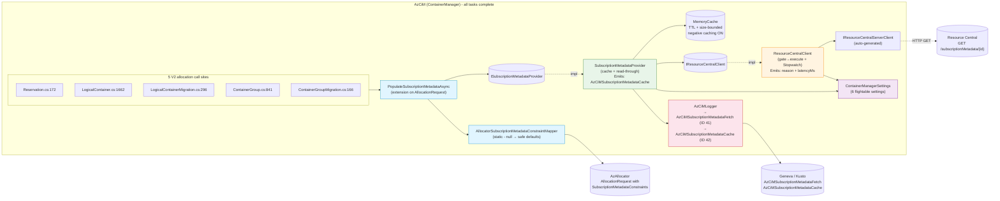

### Complete end-to-end flow

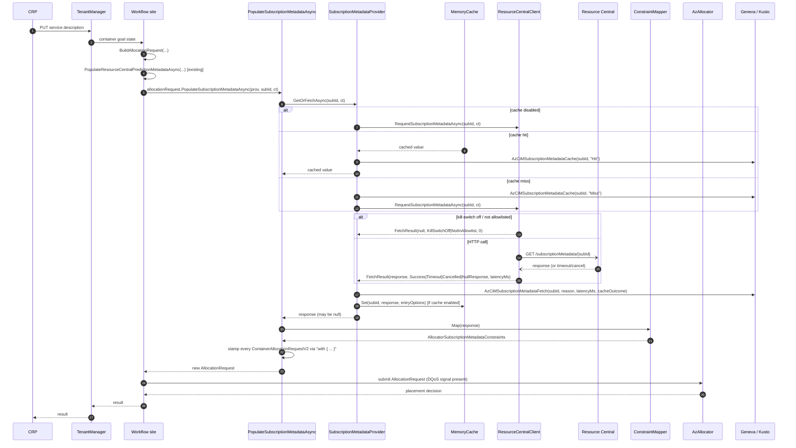

---

## 8. Operational Gating and Settings

Three independent flags must all be satisfied for DQoS priority to actually reach the Allocator:

- `EnableResourceCentralClient` (default `false`) - gates the entire RC client, both prediction metadata and subscription metadata. Likely already on in most clusters, but worth verifying.
- `EnableResourceCentralSubscriptionMetadataClient` (default `false`) - **the DQoS master switch.** Without this, the facade returns `null` before any HTTP work - the cache would just memoise nulls.
- `AllowlistedSubscriptionIdsForResourceCentralSubscriptionMetadataClient` (default empty) - per-subscription opt-in that bypasses the master switch. Lets us pilot specific subscriptions by GUID while the master is still off.
- `EnableSubscriptionMetadataCache` (default `false`) - gates the cache layer. Off means every call hits RC directly - useful during Stage validation to observe raw RC call rates before enabling the cache.
- `SubscriptionMetadataCacheConfiguration` (default `SizeLimit=5000;CompactionPercentage=0.25;ExpirationScanFrequency=60`) - cache container policy.
- `SubscriptionMetadataCacheEntryConfiguration` (default `ExpireAfter=3600`) - per-entry TTL in seconds.

**Effective behaviour by flag combination:**

- Both RC client flags off → no HTTP calls, Allocator gets empty constraints (pre-DQoS behaviour)
- RC client on, subscription-metadata switch off → facade returns null without HTTP, empty constraints
- Both RC flags on, cache off → every reservation hits RC - good for Stage validation
- All three on (including cache) → **full DQoS** - cache-backed, telemetered, priority reaches Allocator

### Aggregate footprint across all tasks

- ~18 production code files, ~450 lines
- 2 generated client + JSON spec files, ~137 lines
- 6 settings files (XML + C# classes), ~58 lines
- 3 BVT mock files, ~27 lines
- ~40 unit test files, ~930 lines
- **Total: ~69 files, ~1,600 lines**

### Key invariant (held across all 4 tasks)

> **A reservation that succeeded before DQoS still succeeds after DQoS, even if every new component fails.**

This is enforced at three independent layers:
1. `ResourceCentralClient` returns `null` (never throws) on any failure
2. `AllocatorSubscriptionMetadataConstraintMapper` maps `null` → `AllocatorSubscriptionMetadataConstraints(false, TDPPriorityValue.None)` - exactly the pre-DQoS default
3. `SubscriptionMetadataProvider` propagates `null` transparently - no exception crosses the provider boundary

---

## 9. HLD Traceability

This section maps every inline comment and open item from Rahul's HLD (including Manthan's review comments) against what was actually built.

### Goals (HLD §3.1)

Manthan asked whether this was for specific workflows only. Rahul confirmed it is workflow-specific. The implementation wired exactly 5 V2 call sites: Reservation, LogicalContainer, ContainerGroup, LogicalContainerMigration, ContainerGroupMigration. No other workflows were touched.

The goal of incremental adoption is satisfied by 6 independent flightable settings. The kill-switch combined with the per-subscription allow-list means any subset of subscriptions can be piloted while the master flag is off everywhere else.

### End-to-End Flow (HLD §4.1)

Manthan asked for explicit fallback behaviour. The implementation returns `null` on every failure path, which flows through the static mapper to pre-DQoS defaults (`IsSensitiveWorkload=false`, `TDPPriorityValue=None`). Allocation still succeeds. This is asserted by 9 mapper tests and 2 extension tests.

Rahul's open question about whether to wait for a timeout or return an immediate default is resolved: the facade applies a 500ms per-call timeout, after which it returns `null` immediately. The workflow is not blocked. The timeout is configurable via `ResourceCentralSubscriptionMetadataRequestTimeoutInMilliseconds`.

### RC API Integration (HLD §5.1)

Manthan asked whether AzCiM always reads from cache. Confirmed: RC is only called on a cache miss. `MockBehavior.Strict` unit tests assert RC is never called on a hit.

The HLD specified per-subscription scope, TTL plus LRU eviction, and a capacity of approximately 5000 subscriptions. The implementation uses `SizeLimit=5000`, `ExpireAfter=3600s`, and size-weighted compaction, which is the closest `Microsoft.Extensions.Caching.Memory` offers to LRU.

The HLD was silent on what to do with null responses. Negative caching was added beyond what the HLD prescribed: null responses are stored unconditionally, which prevents a request storm against RC when a subscription is unavailable or unknown. The TTL controls how long the null is retained. This is covered by the unit test `NullFromRc_IsCachedToo_NextCallHitsCache`.

### AzCiM to Allocator Contract (HLD §5.3) - Known Deviation

The HLD stated the full payload should be passed as-is in a non-bonded pass-through envelope. What was shipped instead is a static mapper that extracts exactly two fields (`IsSensitiveWorkload` and `TDPPriorityValue`) into `AllocatorSubscriptionMetadataConstraints`. The full payload is not passed opaque.

The reasoning: no pass-through-only field exists in RC's response today, so adding an opaque `IBonded<T>` envelope for a field that doesn't exist yet is speculative complexity. If a pass-through-only field arrives from RC in the future, promoting the static record is approximately a 25-line change. Full rationale is in `dqos-task3-design-rationale.md §T3.1`.

This is the one item that needs explicit Rahul sign-off before the PR is merged.

### Open Design Decisions (HLD §6)

All three open items are resolved:
- Contract shape: `AllocatorSubscriptionMetadataConstraints(bool IsSensitiveWorkload, TDPPriorityValue)` is defined, implemented, and tested.
- Priority model: `TDPPriorityValue` enum with values None, Low, Medium, High, decoded from RC `ExtendedProperties["TDPPriorityValue"]` with case-insensitive parsing.
- Cache-miss behaviour: read-through with negative caching, 13 unit tests.

### Risks (HLD §7)

All four risks from the HLD have mitigations in place:
- Metadata staleness: TTL of 3600s, configurable, auto-refresh on expiry.
- Partial failures: three independent firewall layers (client, provider, mapper), none of which throws across boundaries.
- Cache inconsistency: negative caching prevents partial-state entries; TTL bounds drift.
- Fallback correctness: 9 mapper tests assert null maps to pre-DQoS defaults; 2 extension tests assert nothing throws when the provider returns null.

Manthan asked for defined SLI/SLO, dashboards, and actionable signals. The telemetry events are live: `AzCiMSubscriptionMetadataFetch` (ID 41) emits SubscriptionId, Reason, LatencyMs, and CacheOutcome; `AzCiMSubscriptionMetadataCache` (ID 42) emits SubscriptionId and Outcome. Both are queryable in Kusto. Dashboards are tracked separately and are not yet built.

### Validation Plan (HLD §9)

All validation rows are covered:
- Fetch on cache miss: `SubscriptionMetadataProviderTests` miss case, strict mock verifies RC called exactly once.
- Cache hit/miss and TTL: hit, miss, TTL expiry, and eviction callback are all tested.
- Cache hits avoid RC calls: `.Verify(Times.Never)` on strict mock.
- Deterministic fallback: `ResourceCentralClientTests` asserts timeout returns null and kill-switch off returns null.
- Telemetry: structured events with Reason and LatencyMs are live. Dashboards are not yet built.

Manthan asked for automation, test coverage, and cadence. There are 26 subscription-metadata unit tests and 1312 total `ContainerManager.UnitTests`, all passing.

### Rollout Plan (HLD §10)

Phased rollout and feature flags are both in place: 6 flightable settings allow per-subscription enablement via the allow-list while the master switch remains off. Success criteria are not yet formally defined - this depends on the dashboards being built first.

Overall: 15 of 17 HLD items are fully resolved. Two items need action and are detailed in the next section.

---

## 10. Open Questions and Suggestions for Review

The items below are addressed to Rahul and Manthan. The first three require a decision before broad rollout. The remaining four are suggestions for a future iteration.

---

### Q1 - Contract deviation: mapper vs opaque pass-through (for Rahul, decision needed before merge)

**For Rahul.**

The HLD §5.3 says: split into non-opaque (AzCiM-consumed) and opaque bonded (Allocator pass-through) payloads.

What shipped is a **static mapper** that extracts exactly two fields (`IsSensitiveWorkload` + `TDPPriorityValue`) and throws away the rest. There is no opaque `IBonded<T>` envelope.

**Rationale for the deviation:** the only fields RC currently emits that the Allocator cares about both land in the existing `SubscriptionMetadataConstraints` contract shape. Adding an opaque envelope for a pass-through field that doesn't exist yet is speculative complexity. If/when a pass-through-only field arrives from RC, promoting the static record to an `IBonded<T>` wrapper is a ~25-line change.

**Question:** Do you agree with this approach, or should we add the opaque envelope now in anticipation of future RC fields? If you agree, should §5.3 of the HLD be updated to reflect the final decision?

---

### Q2 - Dashboard and success criteria before broad rollout (for Rahul and Manthan, decision needed)

The HLD §9.5 and §10 both reference telemetry and success criteria as prerequisites for broad rollout. The telemetry events are now live (`AzCiMSubscriptionMetadataFetch` ID 41, `AzCiMSubscriptionMetadataCache` ID 42), but no Kusto dashboard or alert exists yet.
- What are the target metrics? Suggested candidates: cache hit rate (>X%), RC latency P99 (<500ms), fallback rate (<Y%), telemetry event volume per region.
- Who owns the dashboard - AzNexus or the monitoring team?
- Should we gate the `EnableSubscriptionMetadataCache=true` SDP rollout on the dashboard being live?

---

### Q3 - TTL and cache capacity defaults need RC team sign-off (for Rahul, decision needed before canary)

Current defaults: `ExpireAfter=3600s` (1 hour TTL), `SizeLimit=5000` subscriptions. These are placeholders - the HLD §5.1 says TTL must be configurable but does not pick a number.
- What RC call rate does 1-hour TTL imply at full fleet scale? Has RC been consulted on the expected QPS?
- Is 5000 the right capacity ceiling? On a replica failover the cache starts empty - a brief RC spike will occur. Is that acceptable at fleet scale?
- Suggested: confirm TTL and SizeLimit with RC before enabling `EnableSubscriptionMetadataCache=true` past Stage.

---

### S1 - Suggestion: collapse the two metadata extension calls into one orchestrator

Today every V2 call site does two sequential awaits:
```csharp
.PopulateResourceCentralPredictionMetadataAsync(...)
// then:
.PopulateSubscriptionMetadataAsync(...)
```
A new V2 call site added in the future could accidentally add only the first and silently skip the DQoS metadata.

**Suggestion:** add a single `PopulateAllResourceCentralMetadataAsync(...)` that calls both in order internally. Five call sites collapse to one signature. Zero behaviour change. Makes it impossible to wire a new site without getting DQoS for free.

---

### S2 - Suggestion: add a comment at the two CancellationToken.None migration call sites

Both `LogicalContainerMigration.cs:296` and `ContainerGroupMigration.cs:166` pass `CancellationToken.None` to `PopulateSubscriptionMetadataAsync`. This is correct (it matches the surrounding `PopulateResourceCentralPredictionMetadataAsync` call's token discipline), but a future reader will flag it as a bug in PR review.

**Suggestion:** add a one-line comment at each site:
```csharp
// CancellationToken.None intentional: matches surrounding RC-prediction call discipline.
// Both metadata fetches must share the same cancellation semantics.
allocationRequest = await allocationRequest.PopulateSubscriptionMetadataAsync(...);
```

---

### S3 - Suggestion: review retry classifier with RC team before canary

`ResourceCentralServerClientErrorTransformer` was extended to cover `GetSubscriptionMetadata`. It should be reviewed with the RC team to confirm we are not retrying any status code they consider terminal for this endpoint (e.g. 404 for unknown subscription should probably not retry).

**Suggestion:** schedule a 30-minute review with RC before canary rollout.

---

### S4 - Suggestion: document replica failover cold-start spike in on-call runbook

All 6 settings have `DoesReplicaNeedFailover = true`, which means the cache starts empty on the new primary after a SF replica failover. At fleet scale this produces a brief burst of RC calls until the cache warms.

**Suggestion:** add a note to the on-call runbook so the team knows that a sudden spike in `AzCiMSubscriptionMetadataFetch` events with `Reason=Success` immediately after a failover is expected, not an incident.
